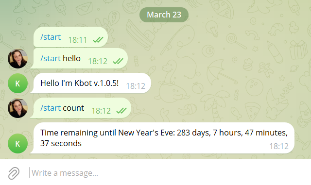

# Hi there! I'm ***KBOT*** created from scratch in scope of *Den Vasyliev's "DevOps and Kubernetes"* course.

> I will continue to improve lesson by lesson, but currently, I'm able to do two realy cool things you would like to have =) :
> - greet if you send me `/start hello`
> - share with you the time to New Year's eve - `/start count`

#### The Telegram bot will have the ability to process messages from users and respond to them:

- Golang
- Frameworks github.com/spf13/cobra and gopkg.in/telebot.v3
- Implement message handlers that will respond to messages in Telegram.
- Create message handling functions.
- Add these functions to the methods of the telebot.Bot object.
- Process messages based to their type and content.
---
#### Local deployment and execution:
1. Clone repository `git clone https://github.com/annadatska/kbot.git`
2. Compile using `go build`
3. Search for `BotFather` in Telegram and create a new bot with `/newbot`
4. Retrieve token and copy it.
5. Set saved token to your bot connection using `read -s TELE_TOKEN` and pasting the token.
5. Confirm saved variable: `echo $TELE_TOKEN`
5. Export variable `export $TELE_TOKEN`
6. Run server `./kbot start`
---
#### How to use kbot
1. Navigate to the link https://t.me/annadatska_bot
2. Start the bot with `/start`
3. Greet the bot with `/start hello`
4. Ask the bot about the time left until the New Year with `/start count`
---

[You can find me here](https://t.me/annadatska_bot)

